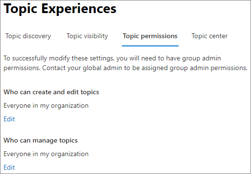
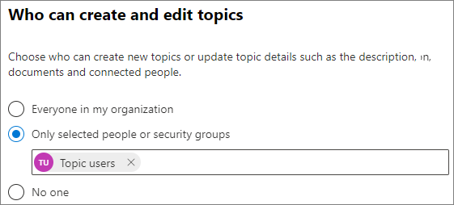

# Manage topic permissions in Topics

You can manage topic permissions settings in the [Microsoft 365 admin center](https://admin.microsoft.com). You must be a global administrator or SharePoint administrator to perform these tasks.

With topic permissions settings you can choose:

- Which users can create and edit topics: Create new topics that were not found during discovery or edit existing topic details.
- Which users can manage topics: Access the topic management center and view feedback on topics as well as move topics through the lifecycle.

## To access topics management settings

1. In the Microsoft 365 admin center, select **Settings**, then **Org settings**.
2. On the **Services** tab, choose **Topics**.

    

3. Select the **Topic permissions** tab. See the following sections for information about each setting.

    

## Change who has permissions to update topic details

To update who has permissions to create and edit topics:

1. On the **Topic permissions** tab, under **Who can create and edit topics**, select **Edit**.
2. On the **Who can create and edit topics** page, you can select:
    - **Everyone in your organization**
    - **Only selected people or security groups**
    - **No one**

      

3. Select **Save**.

To update who has permissions to manage topics:

1. On the **Topic permissions** tab, under **Who can manage topics**, select **Edit**.
2. On the **Who can manage topics** page, you can select:
    - **Everyone in your organization**
    - **Selected people or security groups**

      

3. Select **Save**.
