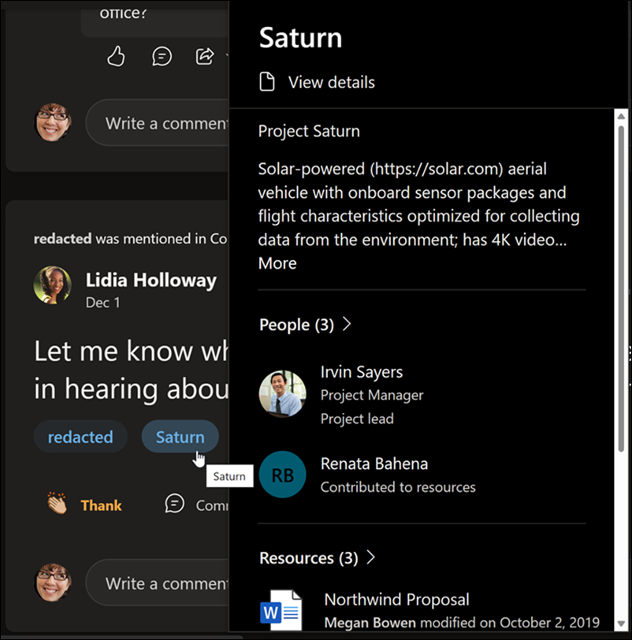
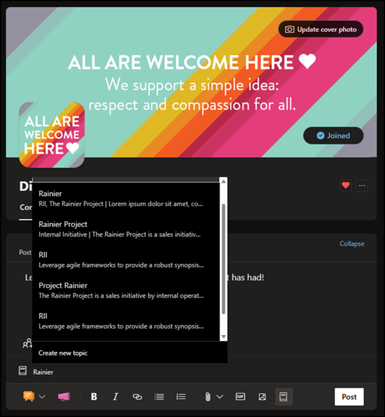

# Topics in Viva Engage

The article covers the Topics migration in the Viva Engage app. You can now access information in Viva Engage through Topics features like the live topic card, highlighted topics, and the topic picker. 

## Topics migration in Viva Engage

Microsoft is aligning to leverage the advantages and capabilities of Topics across all Microsoft 365 apps and services. To ensure that Viva Engage customers can utilize the benefits of Topics, we're integrating Topics into Viva Engage experiences. To deliver this integration, we're migrating Viva Engage topics to Topics. 

As part of the migration, all Viva Engage topics will be migrated to Topics for the tenant. However, only Viva Engage Topics that were used in the last 18 months or are associated with 10 or more conversations, prior to your tenant migration will be available for selection in the topic picker experience.  

Migrated topics will also be accessible through other Microsoft 365 apps and services. Knowledge managers will have to confirm migrated topics.

## Topics permissions and licenses

There's no requirement for the users to have a paid Topics license for the migration. However, to access the topic center and other Topics features, users must have designated Topics permissions. Topic access can be controlled in the Microsoft Admin Center, as a part of the broader Topics product. 

For Viva-licensed tenants, Viva Engage admins will work from [Manage topics](manage-topics.md) to manage Viva Engage topics alongside all other Topics. For unlicensed tenants, Viva Engage admins will use the same controls as before to manage topics in Viva Engage. 

## Experience Topics in Viva Engage

With Topics in Viva Engage, you'll be able to share knowledge and explore more topics in your organization. For example, highlighted topics can appear in conversations and you can provide more content in your Viva Engage posts using the topic picker.

Attaching Viva Engage threads with Topics will have the advantage of ensuring that Viva Engage content shows up across the Microsoft 365 suite wherever the Topics knowledge experiences surface. 
