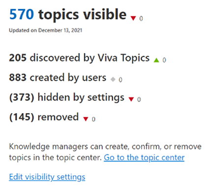
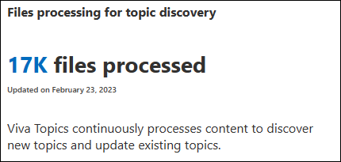
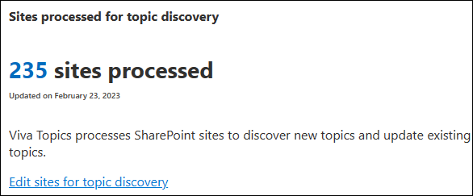

# Analytics for Topics

Insights are available for Topics in the Microsoft 365 admin center. You need to be a SharePoint admin and a Groups admin to see these reports.

To access Topics insights

1. In the Microsoft 365 admin center, expand **Settings** and select **Search & intelligence**.
1. On the **Insights** tab, select **Topics**.

## Topics overview

The **Topics overview** section provides a look at topic visibility in your organization.

The information in this section is based on the time period that you select. The changes from the last time period appear next to each metric. If the time period selected is larger than when data was first available, the delta is collected from a starting point of 0.

|Measure|Value|
|:------|:----|
|Topics visible|The number of topics that are visible to topic viewers in Microsoft 365 locations such as search and SharePoint |
|Discovered by Topics|The number of topics that [Topics has discovered](/viva/topics/topic-experiences-discovery-curation) or that have AI-discovered properties.|
|Created by users|The number of [manually created](/viva/topics/create-a-topic) topics that don't have any AI-discovered properties.|
|Hidden by settings|If you have [configured Topics to not show suggested topics to topic viewers](/viva/topics/topic-experiences-discovery#prevent-topic-viewers-from-seeing-suggested-topics), the number of hidden topics is reflected here|
|Removed|The number of topics that have been [removed by user feedback and knowledge managers](/viva/topics/manage-topics)|

## File processing for topic discovery

The **File processing for topic discovery** section shows the number of files that Topics has processed as it crawls the [content sources that you selected](/viva/topics/topic-experiences-discovery#select-sharepoint-topic-sources).

|Measure|Value|
|:------|:----|
|Unique files processed|The number of files that have been processed for topic discovery. This is a cumulative total since Topics was set up. This number does not decrease if topics are deleted or excluded.|

## Sites processed for topic discovery

The **Sites processed for topic discovery** section shows the number of sites that AI is indexing for content to create topics.

|Measure|Value|
|:------|:----|
|Sites processed|The number of sites that have been indexed by AI for topic discovery and updates in your organization. The site count might not update immediately in the event of deleted sites.|

## Total unique Topics users

>[!NOTE]
>Total unique Topics users metrics are currently only available to users in the Early Adopter Program.

This chart measures how unique users in your organization are engaging with Topics.

- **Search results** measures the number of times a Topic answer is shown.
- **Topic card views** measures the number of times a topic card was viewed.
- **Topic page views** measures the number of times a topic page was viewed.
- **Editing and publishing** measures how many times a topic has been updated and published. Each time a topic is republished counts as an edit. However, draft edits aren't counted. If a user edits two or more things on a topic before publishing or republishing, it will count as one update per publish.
- **Sharing** measures all scenarios related to sharing topics by using the topic picker (# tags). Tagging on Viva Engage and Answers aren't currently counted.
- **Feedback** measures how many times users have responded to feedback questions to improve topics.

>[!NOTE]
>If data isn't available for a certain time period, a dotted line will connect the available data points.
