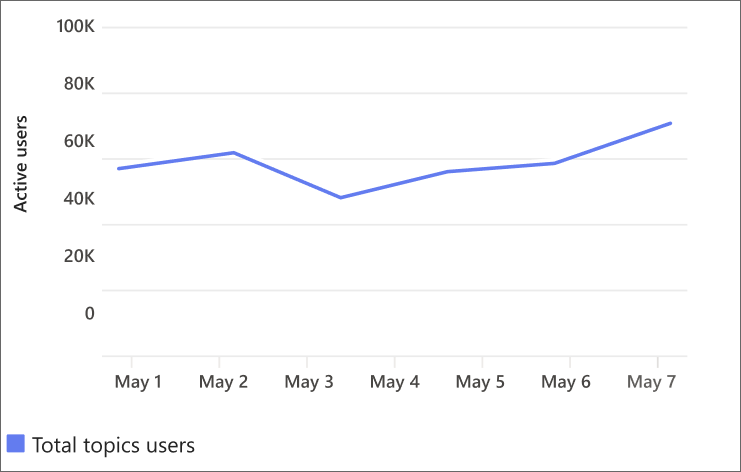
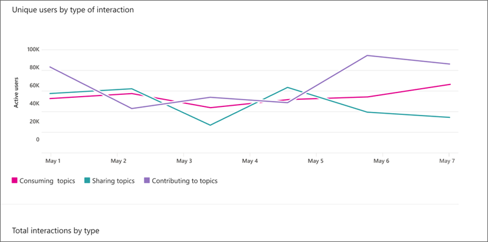
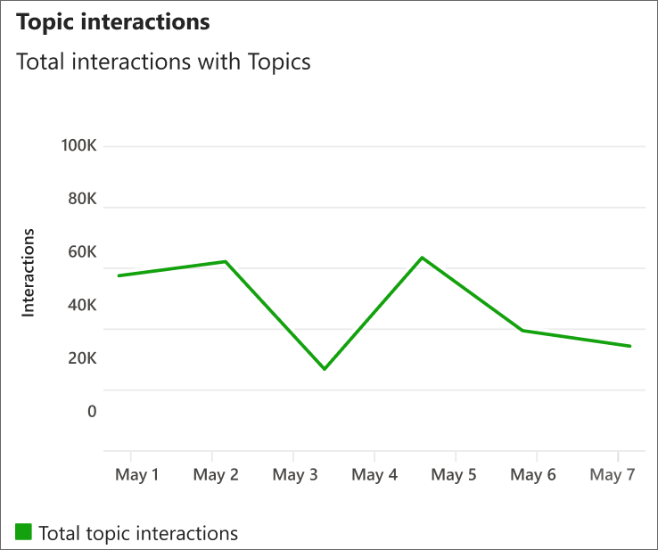
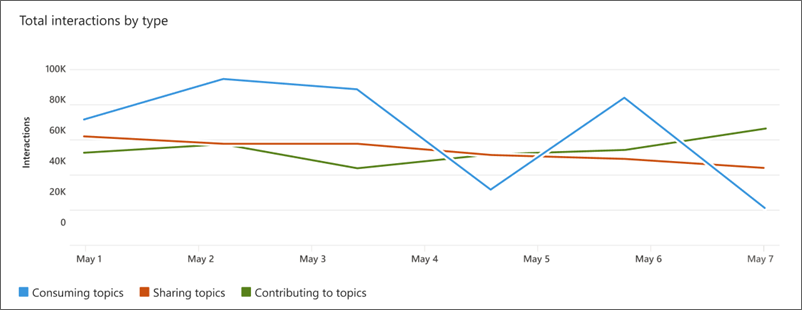
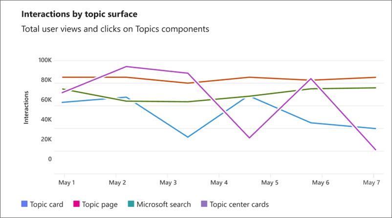
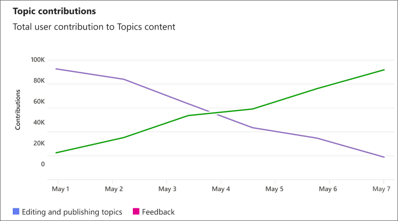

# Usage and engagement metrics in Topics

Usage and engagement metrics demonstrate how users are engaging with Topics in your organization.

To access usage and engagement metrics:

1. In the Topic center, select the **Analytics** tab.
2. In the **Analytics** tab, select **Usage & engagement**.

## Topic engagement: total Topics users

This section shows how unique users in your organization are engaging with topics. This metric counts when a user intentionally views information or knowledge about a topic or when a user interacts intentionally with topics or topic content to consume, use, enhance, or manage knowledge.

>[!NOTE]
>User counts under 100 are exact, while numbers over 100 are approximations within three percent of the exact number.
>All dates and times in charts are in UTC. Topic center data generally updates within two to three minutes of an interaction.

## Topic engagement: Users by type of engagement over time

This section shows unique user counts by type of engagement, including sharing, consuming, and contributing to topics.

- **Sharing** measures all scenarios related to sharing topics by using the topic picker (# tags).
- **Contributing** measures all scenarios where a topic is improved, including topic page edits, publication, and adding or confirming files, people, sites. Contributing also includes other feedback to improve topics.
- **Consumption** measures top-level activity, such as selecting a card or page, but doesn't measure activity within topic cards or pages.

The information in this section is based on the time period that you select. The changes from the last time period appear next to each metric.

## Topic interaction: total topic interactions

This section counts overall interactions with topics by all users. This includes counting when a user interacts intentionally with topics or topic content to consume, use, enhance, or manage knowledge.

## Topic interaction: topic interactions by type over time

This section shows interaction counts by type of engagement including sharing, consuming and contributing to Topics.

- **Sharing** measures all scenarios related to sharing topics by using the topic picker (# tags). Tagging on Viva Engage and Answers aren't currently counted.
- **Contributing** measures all scenarios where a topic is improved, including topic page edits, publication, and adding or confirming files, people, sites. Contributing also includes other feedback to improve topics.
- **Consumption** measures top-level activity, such as selecting a card, but doesn't measure activity within topic cards.

## Topic consumption

The **Topic consumption** section provides a look into how users are consuming topics through topic views and clicks.

**Interactions by topic surface** measures consumption of topics at surface level, including topic cards, topic pages, Microsoft search, and topic center cards.

- **Topic Card** measures the number of times a topic card was viewed.
- **Topic Page** measures the number of times a topic page was viewed.
- **Search** measures the number of times a Topic answer is shown.
- **Topic Center Card** measures the number of times a Topic center card is viewed in users' dashboards.

## Topic contribution

The **Topic contribution** section provides a look into how users contribute to content on topics.

User topic contributions include editing and publishing topics, and providing topic feedback.

- **Feedback** measures how many times users have responded to feedback questions to improve topics.
- **Edits** measures how many times a topic has been updated and published. Each time a topic is republished counts as an edit. However, draft edits aren't counted. If a user edits two or more things on a topic before publishing or republishing, it will count as one update per publish.

