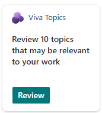
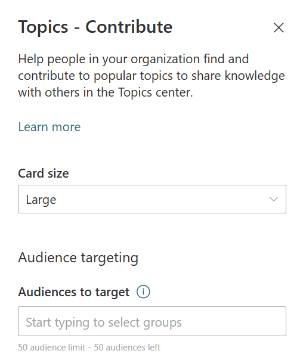
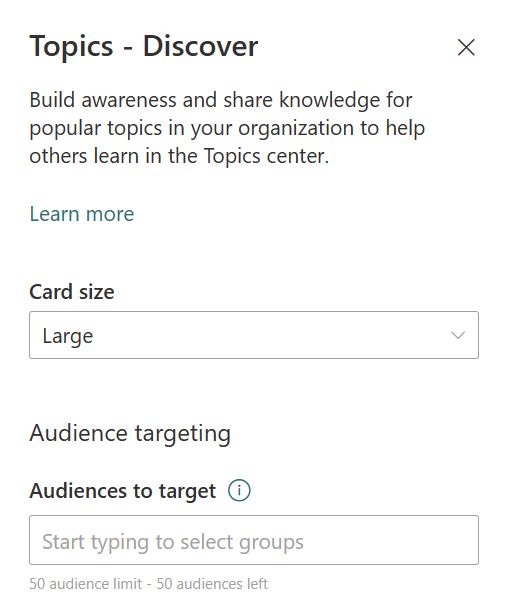

# Use Viva Topics cards in the Viva Connections dashboard

Use Viva Topics cards to encourage knowledge discoverability, engagement, and sharing. Viva Topics has two different cards that can be used on the Viva Connections dashboard. Viva Connections is a personalized employee experience that surfaces the most important content and tools from across your organization. Learn more about [Viva Connections](/viva/connections/viva-connections-overview) and [how to set up a dashboard](/viva/connections/create-dashboard). 

## Viva Topics cards
There are two separate Viva Topics cards for two separate intentions. The **Viva Topics Contribute card** can be used to reach people who are known knowledge managers and are already engaged with topics and knowledge areas. Topics and knowledge areas are dynamically displayed in the card based on the viewers interests, current projects, and expertise. The **Viva Topics Discover card** can be used to view topics and knowledge areas for people who could be interested in learning more or contributing to a topic. Topics and knowledge areas are dynamically displayed in the card based on the viewer’s interests, current projects, and expertise. 

## The Viva Topics Contribute card

 

The Contribute card can be used to reach people who are known knowledge managers and are already engaged with topics and knowledge areas. Topics and knowledge areas are dynamically displayed in the card based on the viewers interests, current projects, and expertise. When viewers engage with the Contribute card, they will be directed to the Topics center where they can view and contribute to topics. 

## The Viva Topics Discover card

 

The Discover card can be used to view topics and knowledge areas for people who could be interested in learning more or contributing to a topic. Topics and knowledge areas are dynamically displayed in the card based on the viewer’s interests, current projects, and expertise. When viewers engage with the Discover card, they will be directed to the Topic center where they can learn more about topics and contribute (Edit an existing topic in Microsoft Viva Topics | Microsoft Docs).

## Use the Viva Topics cards

>[!NOTE]
> - You need site owner permissions or higher to your organization’s [SharePoint home site](/sharepoint/home-site) to edit the Viva Connections dashboard.

Viva Topics cards can be added to the Viva Connections dashboard. The dashboard is one part of the Viva Connections experience that surfaces tools and content relevant to the viewer. [Learn more about how to add Viva Topics cards to the Dashboard](/viva/connections/create-dashboard#create-a-dashboard-and-add-cards).

:::image type="content" alt-text="This screenshot is of the Viva Topics cards in the Viva Connections toolbox." source="../media/knowledge-management/viva-topics-cards-toolbox.png":::

1. Start by navigating to the [SharePoint home site](/sharepoint/home-site) and select **Manage Viva Connections** in the Settings panel.  
2. Select **Create dashboard** or **View dashboard**.
3. Select **Add card** and then select one of the a Viva Topics cards.
4. Select the **Edit** (pencil icon) to open the settings panel where you can choose the card size and add audience to target. 

|Contribute card editing panel  |Discover card editing panel  | 
| :---------------------- | :------------------- |
||  | 

5. Plan to [apply audience targeting for cards](/viva/connections/use-audience-targeting-in-viva-connections#apply-audience-targeting-to-cards-in-the-dashboard) to cards to make sure relevant content is displayed to the appropriate audiences. 
6. [Preview the experience](/viva/connections/create-dashboard#preview-your-dashboard-to-see-how-it-will-display-for-different-audiences) for different audiences and devices by selecting **Preview** in the top-right corner before sharing with others.

## More resources

[Add cards to the Viva Connections dashboard](/viva/connections/create-dashboard) 
