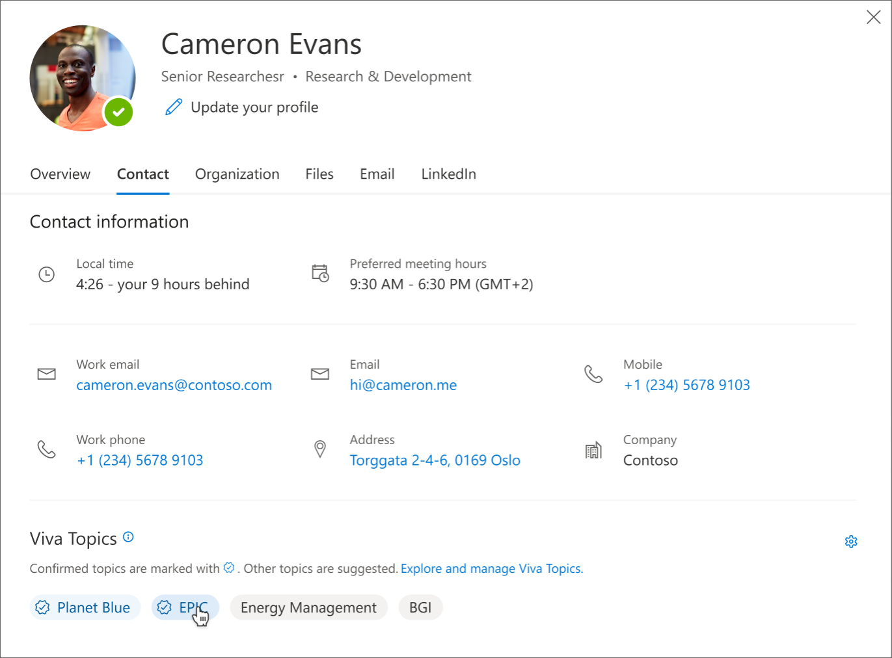
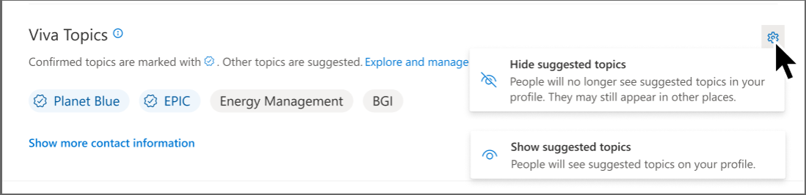

# Where to find topics

## Engage with Topics in Microsoft apps

Topics are integrated throughout Microsoft 365 and other Viva apps.

|  App  | Topics features |
|:-----|:-----|
|[Microsoft 365 admin center](plan-topic-experiences.md)| Topics settings for your organization. Topics analytics and metrics.|
|[SharePoint](search.md)|Topics center, highlighted topics (automatic and user added), topic cards, topic pages, Topics web part can be used anywhere on a SharePoint Modern Site|
|[Teams](https://support.microsoft.com/topic/how-to-find-viva-topics-4c6881d6-e73f-408d-91df-a3e2b93272f3 )|#Topics, Topic picker, Topic cards|
|Outlook Preview and Web |#Topics, highlighted topics, topic cards, profile cards |
|Bing Search |#Topics, Topic pages, Topic answer |
|Yammer and Viva Engage |Topic picker, Topic card |
|[Office.com SharePoint search](search.md) |Topic answer |
|Word, Excel, and PowerPoint |Search Topic answer |
|[Viva Connections](topics-card-viva-connections.md) |Dashboard cards |
|[Viva Engage](https://support.microsoft.com/topic/answers-in-viva-view-and-follow-topics-fd3cf456-28e1-4621-b683-b0d21348a935) |Answers in Viva Engage: Topic picker, Q&A routing |

## How topics are displayed to users

Topics are displayed to users through:

- [Topics highlighted](#sharepoint-highlights) on SharePoint pages
- Topic answers in [search results](#search-results)
- Search in [office applications](#office-application-search)
- [Profile cards](#profile-cards) in Microsoft 365 web apps
- [Topic center](#topic-center) home page

### SharePoint highlights

When a topic is mentioned in content on SharePoint news and pages, you'll see it highlighted. You can open the topic summary from the highlight. Open the topic details from the title of the summary to view the full topic page. The mentioned topic could be identified automatically or could have been referenced directly by the page author.

   

### Search results

You can see a [topic answer](search.md#topic-answer) in search results when you search from the SharePoint start page, search on Office.com, or search from a SharePoint site after you change the search scope to include the full organization. The topic answer will appear at the topic of the results list and give you a short set of information related to that topic.

   

### Office application search

When you use Search in Office apps such as Word, PowerPoint, Outlook, or Excel — either through the search box or by selecting **Search** in the context menu — topic answers are displayed in the search results.

   

   

### Profile cards

When a user selects someone’s name or picture in Outlook or other Office web apps (not including Microsoft Teams), they’ll be able to see what topics they’re associated with. When the user clicks on the topic pill, it redirects them to the topic page where they can see more information about the topic, including alternate names, description as well as other people associations to the topic. Blue topic pills represent confirmed connections, while gray topic pills represent suggested connections.

   
   

Users can choose whether to show or hide suggested topics on their profile card by opening their own card and choosing Settings. Suggested topics may still appear elsewhere in Microsoft 365, such as topic pages and search results.

### Feed

Users can access Feed by opening a new tab in their Edge browser and looking for Microsoft Feed. Feed can also be viewed by going to Office.com and selecting the Feed icon on the left rail.

When a SharePoint object that is already associated with a Topic is shown in Feed items, users will be shown a corresponding Topic pill. Note that only those SharePoint objects that are already associated with an existing Topic are highlighted with a Topic Pill. The number of Topic pills that show up may vary depending on how many qualifying SharePoint objects are present in a user's Feed.

Topics pills can be seen in the feed by Microsoft 365 users who have active Topics licenses. Feed relies on the same access control mechanisms as Topics, and users are only shown Topic pills that they have permission to access. Users with active licenses may not see any Topic pills in their feed if none of the SharePoint objects in their feed are already associated with Topics.

### Topic center

Users can see topics in their organization to which they have a connection on the [topic center home page](topic-center-overview.md#home-page).
