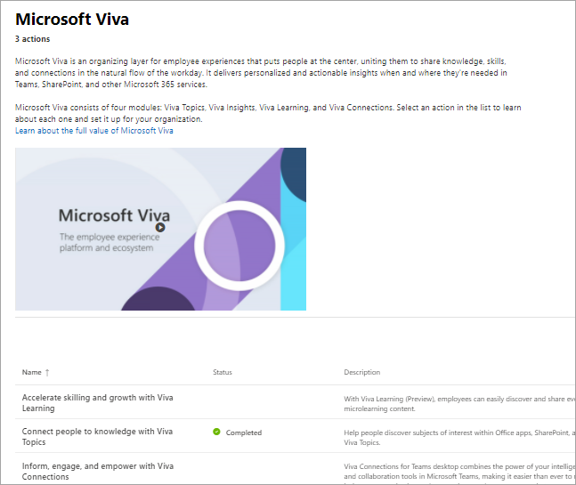

# Set up Microsoft Viva
Microsoft Viva is an organizing layer for employee experiences that puts people at the center, uniting them to share knowledge, skills, and connections in the natural flow of the workday. It delivers personalized and actionable insights when and where they’re needed in Teams, SharePoint, and other Microsoft 365 services. 

Microsoft Viva consists of four modules: Viva Topics, Viva Insights, Viva Learning, and Viva Connections. To set up the whole suite, you’ll set up each module individually.
 
### Start setting up

To jump right in and starting setting up, you'll have to be a Microsoft admin and be signed in to your account. 

[Go directly to the the Microsoft Viva admin page](https://admin.microsoft.com/Adminportal/Home?source=applauncher#/featureexplorer/collections/VivaExperiences)

At the bottom of the page, select the module you want to set up.
On the module page, select the **Go to setup guide** button, or in the case of Viva Topics, select the **Get started** button to go to the Setup wizard that guides you through the process.

Or, if you want to set up later, you can follow these steps:
1.	Go to the Microsoft 365 admin center
2.	Select **Setup** on the left navigation
3.	Select the **Microsoft Viva** tile
4.	At the bottom of the page, select the module you want to set up.
5.	Select the **Go to setup guide** button, or in the case of Viva Topics, select the **Get started** button to go to the Setup wizard that guides you through the process.

### More information
If you want to learn more about each module and how you will set them up first, here are some resources:

**Viva Learning** 

Accelerate skilling and growth – Your employees can easily discover and share everything from training courses to micro-learning content.

[Overview](/microsoft-365/learning)

[Learn how to set it up](/microsoft-365/learning/set-up-teams-admin-center)

**Viva Insights**

Balance productivity and well-being – Provides data-driven, privacy-protected insights and actionable recommendations that help everyone in the organization work smarter and achieve balance.

[Overview](/viva/insights/introduction)

[Learn how to set it up](/viva/insights/setup/setup-intro)

**Viva Topics**

Connect people to knowledge – People can easily discover topics of interest within Office apps, SharePoint, and search results.

[Overview](/microsoft-365/knowledge/)

[Learn how to set it up](/microsoft-365/knowledge/set-up-topic-experiences)

**Viva Connections**

Inform, engage, and empower -- Microsoft Viva Connections is your gateway to a modern engagement experience designed to keep everyone engaged and informed.

[Overview](/sharepoint/viva-connections-overview)

[Learn how to set it up](/sharepoint/guide-to-setting-up-viva-connections)

**More information**

[Get additional documentation and ways to learn about Microsoft Viva](/microsoft-365/viva)
